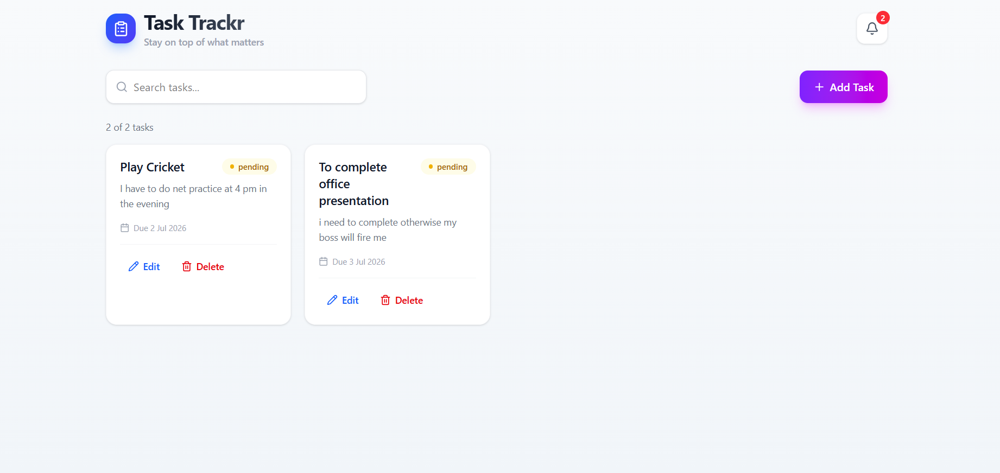
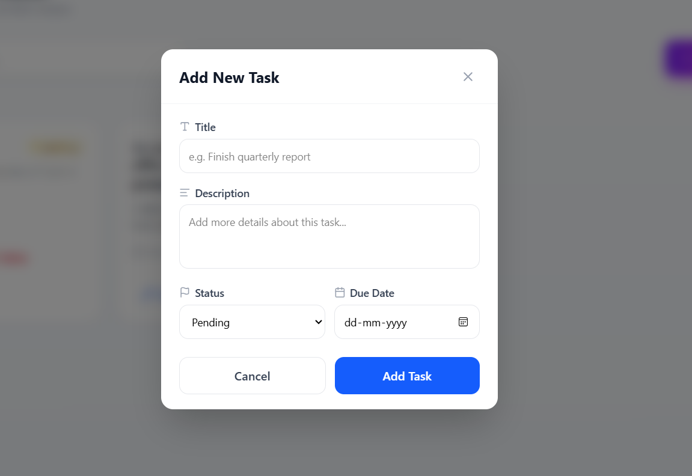

# 📝 Task Trackr

A modern **Task Management Application** built with the **MERN Stack** that helps users organize, manage, and track their daily tasks efficiently. The application provides full CRUD functionality, task search, due-date notifications, and a clean responsive interface for a seamless user experience.

## 🚀 Live Demo

- **Frontend:** https://task-trackr-olive.vercel.app/
- **Backend API:**https://task-trackr-l3tt.onrender.com
---

## ✨ Features

- ➕ Create new tasks
- 📋 View all tasks
- ✏️ Edit existing tasks
- 🗑️ Delete tasks
- 🔍 Search tasks instantly
- 🔔 Due date notifications
- 📅 Manage task deadlines
- 📱 Fully responsive UI
- 🎨 Modern interface built with Tailwind CSS
- ⚡ RESTful API using Express.js
- ☁️ MongoDB Atlas database integration

---

## 🛠️ Tech Stack

### Frontend
- React.js
- Vite
- Tailwind CSS
- Axios
- React Hot Toast
- Lucide React

### Backend
- Node.js
- Express.js
- MongoDB Atlas
- Mongoose
- CORS
- Dotenv

### Deployment
- Frontend: Vercel
- Backend: Render
- Database: MongoDB Atlas

---

## 📂 Project Structure

```text
Task-Trackr/
|----- screenshots/
├── backend/
│   ├── controllers/
│   ├── models/
│   ├── routes/
│   ├── app.js
│   ├── package.json
│   └── .env
│
├── frontend/
│   ├── src/
│   │   ├── components/
│   │   ├── services/
│   │   ├── App.jsx
│   │   └── main.jsx
│   ├── public/
│   ├── package.json
│   └── vite.config.js
│
├── .gitignore
└── README.md
```

---

## 📸 Application Preview

> Add screenshots of your application in a folder named `screenshots`.


| Home | Add Task |
|------|----------|
|  |  |

---

## ⚙️ Installation & Setup

### 1. Clone the Repository

```bash
git clone https://github.com/Priyanshu45Kumar/Task-Trackr.git

cd Task-Trackr
```

---

### 2. Backend Setup

```bash
cd backend

npm install
```

Create a `.env` file:

```env
PORT=5000

MONGO_URI=YOUR_MONGODB_CONNECTION_STRING
```

Run the backend:

```bash
npm run dev
```

---

### 3. Frontend Setup

```bash
cd frontend

npm install

npm run dev
```

---

## 📡 REST API Endpoints

| Method | Endpoint | Description |
|---------|----------|-------------|
| GET | `/api/tasks` | Fetch all tasks |
| POST | `/api/tasks` | Create a new task |
| PUT | `/api/tasks/:id` | Update a task |
| DELETE | `/api/tasks/:id` | Delete a task |

---

## 🎯 Future Improvements

- 🔐 User Authentication (JWT)
- 🏷️ Task Categories
- 🚩 Priority Levels
- 🌙 Dark Mode
- 📊 Dashboard Analytics
- 📧 Email Reminder Notifications
- 🖱️ Drag & Drop Task Board
- 📑 Pagination & Sorting

---

## 👨‍💻 Author

**Priyanshu Kumar**

- GitHub: https://github.com/Priyanshu45Kumar
- LinkedIn: https://www.linkedin.com/in/priyanshu-kumar-62b58b315/

---

## ⭐ Support

If you found this project helpful, consider giving it a ⭐ on GitHub!